**DOCUMENTATION IS UNDER CONSTRUCTION**

# csvsuite
## The same as [csvkit](https://csvkit.readthedocs.io/en/latest/), but written in C++

*    [About](#about)
*    [Restrictions](#restrictions)
*    [Tutorial](#tutorial)
*    [Statistics performance](#statistics-performance)
*    [Sorting performance](#sorting-performance)
*    [SQL performance](#sql-performance)
*    [Joining performance](#joining-performance)
*    [Build All](#build-all)
*    [Testing](#testing)
*    [Installation](#installation)
*    [Reference](#reference)

### About
_csvsuite_ is written to dramatically increase the speed of working with large amounts of data by taking advantage of
the high-performance compiled programming language C++.

It is written on top of the [csv_co](https://github.com/wiluite/CSV_co) CSV reader and, where needed, with the help of
the task-based parallelism library [transwarp](https://github.com/bloomen/transwarp) and the thread pool-based library
[poolSTL](https://github.com/alugowski/poolSTL).
It tries to reproduce the functionality of the [csvkit](https://csvkit.readthedocs.io/en/latest/) whenever possible.

The goals for the reproduction were: to find out the complexity and limitations of the applicability of the C++
ecosystem for broad universal tasks, where Python is good with its rich environment for data processing, text encoding,
localization, SQL databases and so on. It was also interesting to see the performance benefits of C++ applications in
non-traditional areas. These utilities (from 14) seem to be almost fully operational at the moment:
1) csvClean (ala [csvclean](https://csvkit.readthedocs.io/en/latest/scripts/csvclean.html))
2) csvCut (ala [csvcut](https://csvkit.readthedocs.io/en/latest/scripts/csvcut.html))
3) csvGrep (ala [csvgrep](https://csvkit.readthedocs.io/en/latest/scripts/csvgrep.html))
4) csvJoin (ala [csvjoin](https://csvkit.readthedocs.io/en/latest/scripts/csvjoin.html))
5) csvJson (ala [csvjson](https://csvkit.readthedocs.io/en/latest/scripts/csvjson.html))
6) csvLook (ala [csvlook](https://csvkit.readthedocs.io/en/latest/scripts/csvlook.html))
7) csvSort (ala [csvsort](https://csvkit.readthedocs.io/en/latest/scripts/csvsort.html))
8) csvStack (ala [csvstack](https://csvkit.readthedocs.io/en/latest/scripts/csvstack.html))
9) csvStat (ala [csvstat](https://csvkit.readthedocs.io/en/latest/scripts/csvstat.html))
10) csvSql (ala [csvsql](https://csvkit.readthedocs.io/en/latest/scripts/csvsql.html))
11) Sql2csv (ala [sql2csv](https://csvkit.readthedocs.io/en/latest/scripts/sql2csv.html))
12) In2csv (ala [in2csv](https://csvkit.readthedocs.io/en/latest/scripts/in2csv.html))

  > The _csvsuite_ is in the active stage of development. But, as you will see, is already quite usable. Bug reports,
  scenarios that failed are very welcome. Well, it is imperfect, but it will improve.


### Restrictions
1) Your CSV sources must be [RFC-4180](https://en.wikipedia.org/wiki/Comma-separated_values)-compliant. Fortunately, the
overwhelming percentage of documents in the world adhere to this rule. If not, you can/should always resort to the
[csvClean](#csvclean) (or even a more powerful one from the original package:
[csvclean](https://csvkit.readthedocs.io/en/latest/scripts/csvclean.html)), to fix your document. In any case, such
document just obviously needs to be fixed.

2) The only 2 of utilities of the Python's original are not implemented for not being too actual:
[csvformat](https://csvkit.readthedocs.io/en/latest/scripts/csvformat.html),
[csvpy](https://csvkit.readthedocs.io/en/latest/scripts/csvpy.html).

3) Due to the fact the _csvsuite_ will work with RFC-4180-compliant only, the following options are unsupported:

| unsupported options                      |
|------------------------------------------|
| -d DELIMITER, --delimiter DELIMITER      |
| -t, --tabs                               |
| -q QUOTECHAR, --quotechar QUOTECHAR      |
| -u {0,1,2,3}, --quoting {0,1,2,3}        |
| -b, --no-doublequote                     |
| -y SNIFF_LIMIT, --snifflimit SNIFF_LIMIT |

   The remaining options (or even newly introduced by the _csvsuite_ ) are present and almost certainly implemented.
When running, any utility tries to quickly check the strong tabular shape of your documents to match [RFC-4180] and
whistles if this is not the case.  

4) When handling date and datetime data types and their localization, the _csvkit_ relies on the rich Python datetime
library. It also allows you to work with time representations such as 'yesterday', 'today', 'tomorrow', and so on.
The _csvsuite_ , though, is tightly bound to the --date-format and --datetime-format options and works well only on
those platforms where this is supported by the environment/compiler/standard library. And the --date-lib-parser
option engages the special [date](https://github.com/HowardHinnant/date) library to improve the situation and ensure
consistency everywhere (on most platforms). For more info see tests located in the
[csvsuite_core_test.cpp](https://github.com/wiluite/csvsuite/blob/main/suite/test/csvsuite_core_test.cpp) module. For
complete info see [formatting section](https://howardhinnant.github.io/date/date.html#from_stream_formatting) of the
documentation.

5) Locale support for numbers is provided out of the box, that is, by the development tool. If there is no such support
somewhere (for example MinGW/Windows), you will not be able to work with locale-formatted numbers.

6) Other restrictions and some substitutions are presented in section [Reference](#reference), describing utilities.


### Tutorial
### 1. Getting started
#### 1.1. About this tutorial
This tutorial should be almost exactly the same as the original tutorial.
#### 1.2. Installing csvsuite
The best way to install the tool is to simply download a required binary archive from the
[release](https://github.com/wiluite/csvsuite/releases) page and unpack it. Then add the path to the unpacked directory
root to the list of directories in which to search for commands, according to the rules for doing this for this
particular operating system. See [Installation](#installation) section for details.

See also [Build All](#build-all) section.

#### 1.3. Remaining steps
Just repeat the lessons from the original training:
[1.3 - 1.8](https://csvkit.readthedocs.io/en/latest/tutorial/1_getting_started.html),
[2.1 - 2.4](https://csvkit.readthedocs.io/en/latest/tutorial/2_examining_the_data.html),
[3.1 - 3.4](https://csvkit.readthedocs.io/en/latest/tutorial/3_power_tools.html),
[4.1](https://csvkit.readthedocs.io/en/latest/tutorial/4_going_elsewhere.html), and make sure everything works,
but first pay attention to the following notes for changes for you to do.  

**_Note 1._** Parts of utility names that reflect their purpose are capitalized to avoid confusion between the
_csvsuite_ and the _csvkit_ on case-sensitive systems. Thus, you must type their names correctly. See their names in the
[About](#about) section.  

**_Note 2._** In paragraph 1.4, note that in the resulting data.csv document in the 10th column (ship_date), there is a
number, not a date. If this is too important for you right now, then to improve it, run the following command instead of
the one suggested:

    In2csv ne_1033_data.xlsx --d-excel ship_date --is1904=0 > data.csv

The reason the _csvkit_ can detect the date automatically is because it relies on the heuristic capabilities of packages
like [xlrd](https://xlrd.readthedocs.io/en/latest/) and [openpyxl](https://openpyxl.readthedocs.io/en/stable/), which do
not guarantee that dates/datetimes are correctly recognized, since Excel documents themselves do not have a date or
datetime storage type. So you are facing the necessity to always specify which numeric columns and using which era you
want to convert to dates or datetimes.  

**_Note 3._** In paragraphs where _csvLook_ is used, you will not see (by default) separators in the numbers displayed
on the screen, unlike _csvStat_ which displays number separator according to the current global locale. This is because
in the _csvkit_ there is a difference between the locales according to which numbers are output in the two utilities.
To overcome this contradiction and still see separators in numbers, simply specify the locale in which you want to see
them. For example:

    csvCut -c acquisition_cost data.csv | csvLook data.csv -G en_US
or  
	
    csvCut -c acquisition_cost data.csv | csvLook data.csv -G en_US.utf-8  
where -G option is a "Superseded global locale".  

**_Note 4._**
In the _csvStat_ utility, "Most common values" with the same number of repetitions may not be the same as in the
original utility, due to different sorting algorithms. To display more data, use the --freq-count option.

**_Note 5._** In paragraph 3.3 you must use: `--db sqlite3://leso.db` instead of `--db sqlite:///leso.db`. For more
details, see the description of the --db option in the utilities [_csvSql_](#csvsql) and [_Sql2csv_](#sql2csv).


### Statistics performance
There were measured the performances of three tools: [csvkit(2.0.1)'s csvstat](https://pypi.org/project/csvkit/), 
[xsv(0.13.0)' stats](https://github.com/BurntSushi/xsv/releases/tag/0.13.0) and [_csvStat_](#csvstat) at files: 
crime.csv, worldcitiespop.csv, flights.csv and question_tags.csv with (or with no) a limited number of columns
(so as not to break up screenshots). Here are the result screenshots:  

**CRIME.CSV**

<h4>(csvkit)</h4>
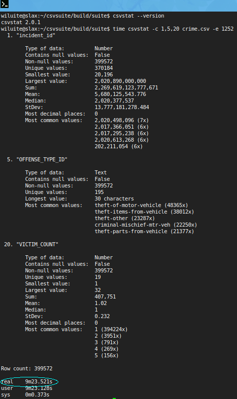

<h4>(xsv)</h4>
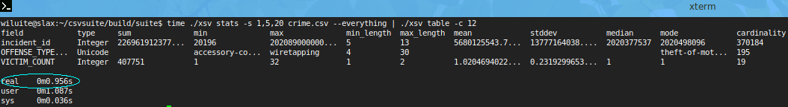

<h4>(csvsuite)</h4>
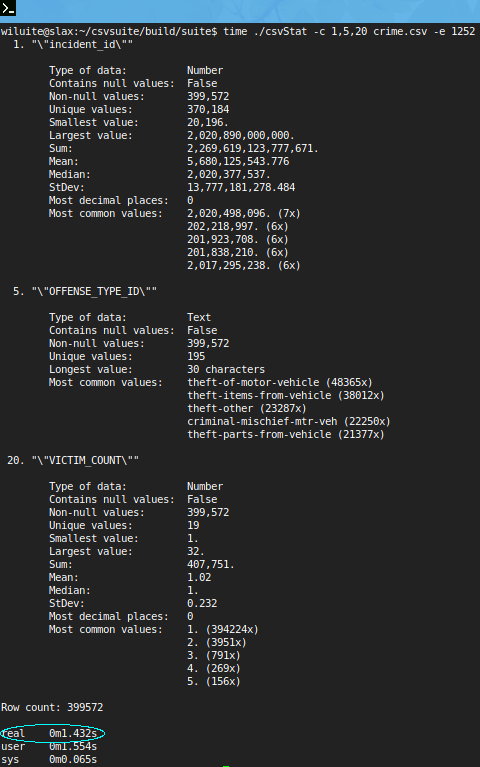

Here, xsv is the winner. It produces results in less than a second.

---

**WORLDCITIESPOP.CSV**  

<h4>(csvkit)</h4>
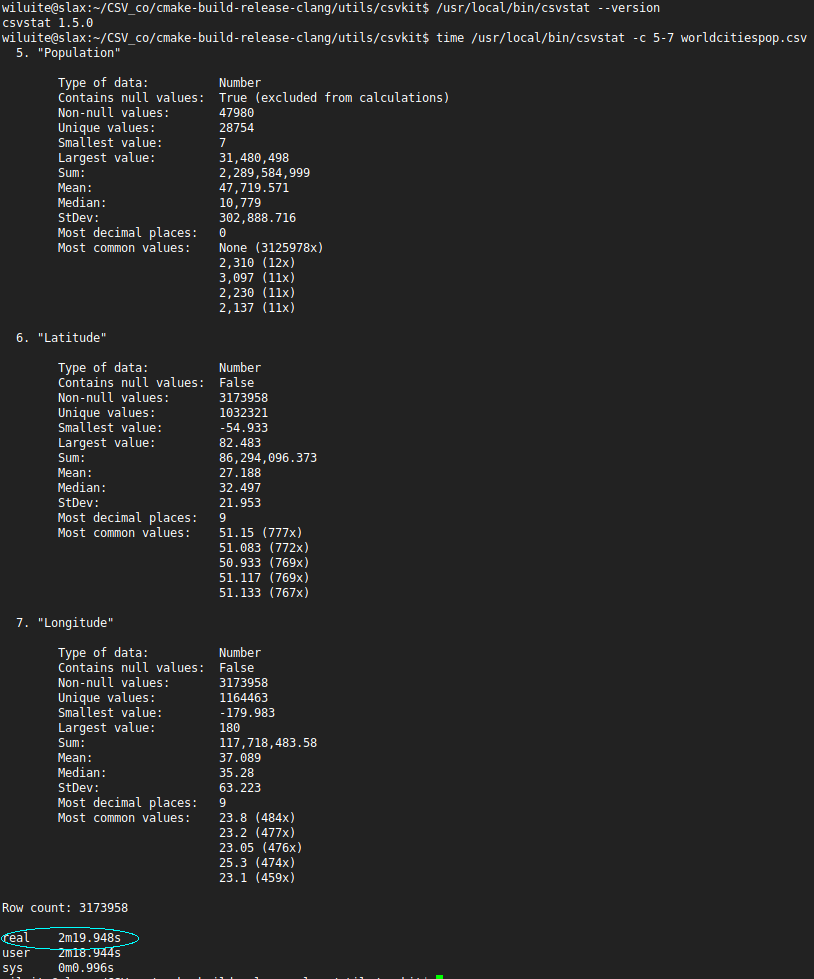

<h4>(xsv)</h4>
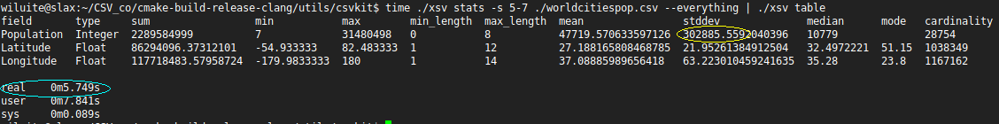

<h4>(csvsuite)</h4>


Here, we are the winner. Note: since _xsv_ does not calculate 'most decimal places' in its statistics, unlike _csvkit_ ,
we have disabled this option at ours.

---

**FLIGHTS.CSV**

<h4>(csvkit)</h4>
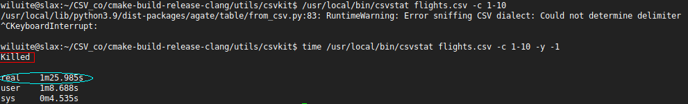

<h4>(xsv)</h4>
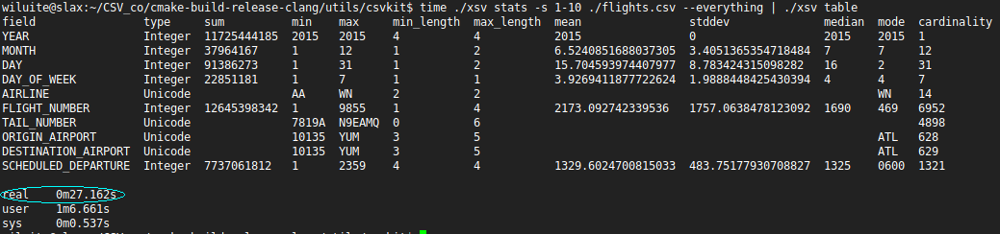

<h4>(csvsuite)</h4>
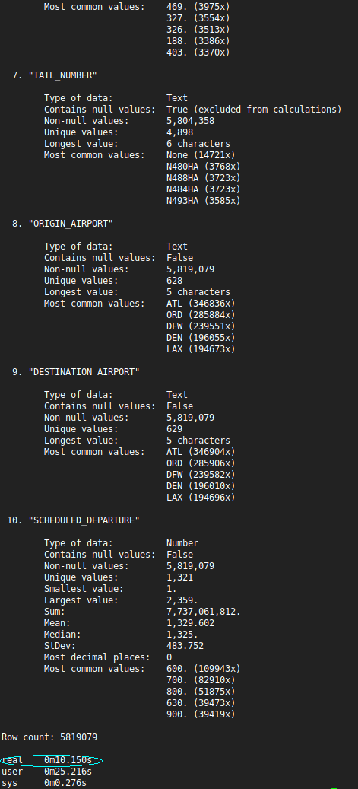

Here we again beat xsv by more than 2 times by doing statistics on the first 10 columns. If we did full statistics on
all the columns, xsv would run out of memory on our current machine (we had 12 GB RAM), as in the following test.
The _csvkit_ is out of the competition.

---

**QUESTION_TAGS.CSV**

<h4>(xsv)</h4>
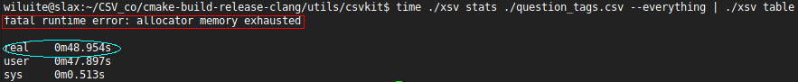

<h4>(csvsuite)</h4>
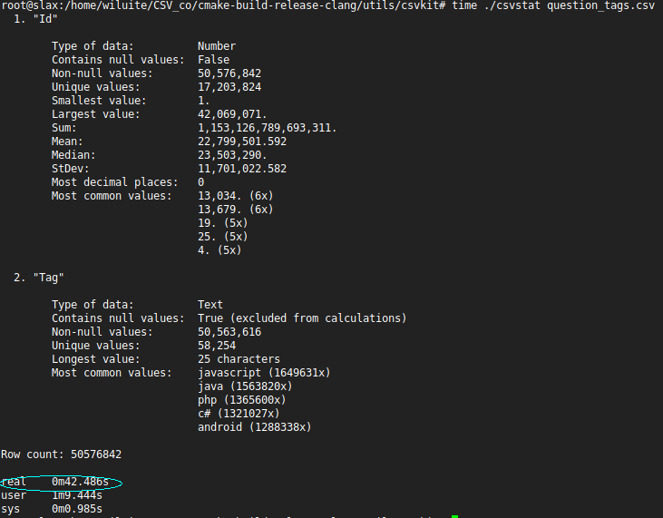

Our tool gives the result in about 42 seconds. Here we could not wait for the result from csvkit within a reasonable
time. Thus, both the _csvkit_ and the _xsv_ are unable to produce their results where for out tool the reason why this
is not possible is not the case. This is a subject for further research.


### Sorting performance
If we talk about sorting by columns of string types, then the xsv is unrivaled, far ahead of other means in time, because
it obviously uses efficient algorithms for sorting strings, and without the use of parallelism. However, let's see how
effective it is to sort a group of columns where there is one numeric type (the -N option is required, otherwise the
results will be incorrect). We only need about 7 seconds versus 21 at the xsv. The csvkit is more than a minute behind us.

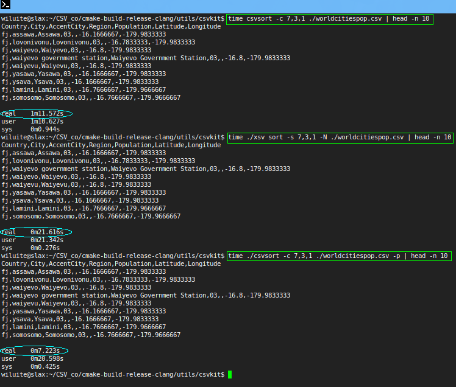


### SQL performance
C++ is said to outperform Python in general, non-specialized areas by about 3 times. In this case, it is so. And even
better. In light of the impossibility of parallelizing the filling of the database table using language tools.
Here it turned out 4 times faster, because the csvkit spends a significant part of the time determining column types,
unlike our tool.

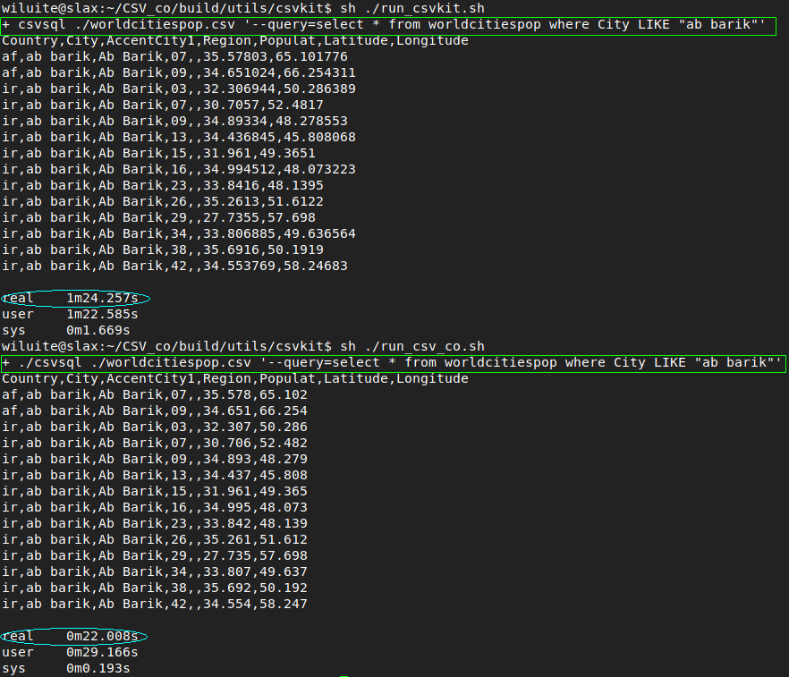

### Joining performance
Now we will try to display the first 10 results corresponding to the conditions when the City and AccentCity fields in
the worldcitiespop.csv file are equal. Here the _csvJoin_ outperforms the _csvjoin_ only by a factor of 4.

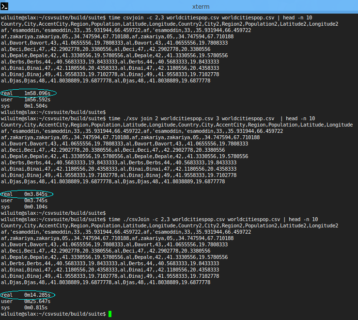

We see that the results calculated using the _csvjoin_ and the _csvJoin_ are the same, which is not the case with
the _xsv_, whose results are incorrect, although they are mind-blowingly fast.
Despite the _xsv_'s enormous performance in all previous tests (in many tests not shown, the _xsv_ simply outperforms
the _csvsuite_ by many times), it doesn't do everything right. Let's criticize it a little more.


### Build All

> For now, you need Python installed to configure several libraries used. Over time, this dependence will be removed.

#### PREPARATION

Install the necessary SQL database servers and client libraries for them into the system, if not already done. This is
necessary for the build system to create the appropriate libraries for the [csvSql](#csvsql) and [Sql2csv](#sql2csv)
utilities. Thanks to [SOCI - The C++ Database Access Library](https://github.com/SOCI/soci) and
[OCILIB - Driver for Oracle](https://vrogier.github.io/ocilib/) the _csvsuite_ supports the following SQL databases:

- Linux: SQLite3, MySQL, MariaDB, PostgreSQL, Firebird, Oracle (not tested).
- Windows: SQLite3, MySQL, MariaDB, PostgreSQL, Firebird, Oracle.

> Please, refer to the SOCI documentation to find out which versions of these databases are supported.  
> Please, refer to the OCILIB documentation to find out which versions of ORACLE databases are supported.  
> Access to other databases within the _csvsuite_ is disabled due to lack of verification capabilities.  

* **Linux**

  It seems that no additional preparations required. Except for, you may need to create ORACLE_HOME environment
  variable. Example:
  > export ORACLE_HOME=~/product/21c/dbhomeXE

  in your user's  ~/.profile, and reboot.

* **Windows**

  Add to the PATH environment variable the access paths to the bin and lib directories of your databases (except for
  for SQLite3). Examples:
  > C:\Program Files\MySQL\MySQL Server 8.0\bin;<br>
  > C:\Program Files\MySQL\MySQL Server 8.0\lib;<br>
  > C:\Program Files\Firebird\Firebird_5_0;

  Create ORACLE_HOME environment variable. Example:
  > ORACLE_HOME=C:\app\youruser\product\21c\dbhomeXE
  

#### BUILD VARIANTS

_Conventional (Linux/GCC, Windows/MinGW):_
```bash
mkdir build && cd build
cmake ..
make -j 6
```

_Alternative 1 (Linux, with Clang >= 15):_
```bash
mkdir build && cd build
cmake -DCMAKE_CXX_COMPILER=clang++ -DCMAKE_C_COMPILER=clang -D_STDLIB_LIBCPP=OFF ..
make -j 6
```
NOTE: You may have to specify an explicit compiler version (example: clang++-16 instead of clang, clang-16 instead of clang). 
 
_Alternative 2 (Linux, with Clang, libc++-dev, libc++abi-dev packages installed):_
```bash
mkdir build && cd build
cmake -DCMAKE_CXX_COMPILER=clang++ -DCMAKE_C_COMPILER=clang -D_STDLIB_LIBCPP=ON ..
make -j 6
```
NOTE: You may have to specify an explicit compiler version (example: clang++-16, clang-16). 

_Test build for memory safety (Linux, with Clang, libc++-dev, libc++abi-dev, and Clang sanitizers packages installed):_
```bash
mkdir build && cd build
cmake -DCMAKE_CXX_COMPILER=clang++ -DCMAKE_C_COMPILER=clang -D_STDLIB_LIBCPP=ON -D_SANITY_CHECK=ON -DCMAKE_BUILD_TYPE=Debug ..
make -j 4
```
NOTE: You may have to specify an explicit compiler version (example: clang++-16, clang-16). 

_MSVC (Windows, in x64 Native Tools Command Prompt):_
```bash
mkdir build && cd build
cmake -G "Visual Studio 17 2022" -DCMAKE_BUILD_TYPE=Release ..
msbuild /property:Configuration=Release csvsuite.sln
```

_Docker container (Linux):_

Go to the csvsuite directory, then build a necessary docker image:
```bash
docker build -t foo/your_image_name -f ./a_dockerfile .
```
Run a docker container from the new docker image:
```bash
docker run -it --rm --name=random_name --mount type=bind,source=${PWD},target=/src foo/your_image_name
```
Inside the docker container build all:
```bash
cd src && mkdir build && cd build && cmake .. && make -j 4 all
```

### Testing
This assumes that you have successfully [built](#build-all) the product.  
Create necessary testing SQL databases, and the following environment variables with your own corresponding values, to
successfully test all branches of the [csvSql](#csvsql) utility. This step is not necessary if you've built the product
in a Docker container, where the environment is completely customized.

* **Linux**

  > SOCI_DB_SQLITE3="sqlite3://db=test.sqlite3" <br>
  > SOCI_DB_MYSQL="mysql://db=your_db user=your_user password=your_password host=127.0.0.1 port=3306" <br>
  > SOCI_DB_MARIADB="mariadb://db=your_db user=your_user password=your_password host=127.0.0.1 port=3307" <br>
  > SOCI_DB_POSTGRESQL="postgresql://dbname=your_db user=your_user password=your_password" <br>
  > SOCI_DB_FIREBIRD="firebird://service=/path_to/your_db.fdb user=SYSDBA password=masterkey"

* **Windows**

  > SOCI_DB_SQLITE3=sqlite3://db=test.sqlite3 timeout=2 share-cache=true <br>
  > SOCI_DB_MYSQL=mysql://db=your_db user=your_user password=your_password host=127.0.0.1 port=3306 <br>
  > SOCI_DB_MARIADB=mysql://db=your_db user=your_user password=your_password host=127.0.0.1 port=3307 <br>
  > SOCI_DB_POSTGRESQL=postgresql://dbname=your_db user=your_user password=your_password <br>
  > SOCI_DB_FIREBIRD=firebird://service=d:\\your_directory_path\\your_db.fdb user=SYSDBA password=masterkey <br>
  > SOCI_DB_ORACLE="oracle://service=//127.0.0.1:1521/xepdb1 user=hr password=hr"

Go to your build/suite/test directory and run all the unit tests:

```bash
ctest -j 1 --repeat until-fail:10 --stop-on-failure
```
  > You could run tests in parallel as well (ctest -j 6), but keep in mind csvSql_test and Sql2csv_test executables may
    have non-shared states.

### Installation
In general, the _csvsuite_ should not be installed into system directories. It is enough to leave binary build results
in place. Or, unpack a ready-made binary archive from the releases page into any directory. In both cases, you only need
to establish global paths.

* **Linux**

  - If you've built it, please modify your ~/.profile to have:
  > export PATH=$PATH:/path/to/csvsuite/suite/build/

  and reboot.

  - If you've downloaded it as a binary release, please modify your ~/.profile to have:
  > export PATH=$PATH:/path/to/unpacked/archive <br>
  > export LD_LIBRARY_PATH=/path/to/unpacked/archive/lib:$LD_LIBRARY_PATH

  and reboot.

* **Windows**

  - If you've built it, add the path to your build\suite directory to the Path environment variable.
  - If you've downloaded it as a binary release, add the path to the root of the unpacked archive to the Path
    environment variable.
  - If you've downloaded a MSVC binary archive, please install a redistributable package as well.


### Reference

*    [Input](#input)
*    [Processing](#processing)
*    [Output and Analysis](#output-and-analysis)

---

#### Input
* [In2csv](#in2csv)
* [Sql2csv](#sql2csv)

---

#### In2csv
##### Description
Converts various tabular data formats into CSV.

Converting fixed width requires that you provide a schema file with the “-s” option. The schema file should have the
following format:

    column,start,length
    name,0,30
    birthday,30,10
    age,40,3

The header line is required though the columns may be in any order:

    Usage: In2csv arg_0  [options...]  
    arg_0 : The file of a specified format to operate on. If omitted, will accept input as piped data via STDIN. [default: ]

Options:

    --help : print help [implicit: "true", default: false]
    -f,--format : The format {csv,dbf,fixed,geojson,json,ndjson,xls,xlsx} of the input file. If not specified will be inferred from the file type. [default: ]  
    -s,--schema : Specify a CSV-formatted schema file for converting fixed-width files. See In2csv_test as example. [default: ]  
    -k,--key : Specify a top-level key to look within for a list of objects to be converted when processing JSON. [default: ]  
    --non-flat : Specify, whether to navigate through nested structures when processing JSON. [implicit: "true", default: false]
    -n,--names : Display sheet names from the input Excel file. [implicit: "true", default: false]  
    --sheet : The name of the Excel sheet to operate on. [default: ]  
    --write-sheets : The names of the Excel sheets to write to files, or "-" to write all sheets. [default: ]  
    --use-sheet-names : Use the sheet names as file names when --write-sheets is set. [implicit: "true", default: false]  
    --encoding-xls : Specify the encoding of the input XLS file. [default: UTF-8]  
    --d-excel : A comma-separated list of numeric columns of the input XLS/XLSX/CSV source, considered as dates, e.g. "1,id,3-5". [default: none]  
    --dt-excel : A comma-separated list of numeric columns of the input XLS/XLSX/CSV source, considered as datetimes, e.g. "1,id,3-5". [default: none]  
    --is1904 : Epoch based on the 1900/1904 datemode for input XLSX source, or for the input CSV source, converted from XLS/XLSX. [implicit: "true", default: true]  
    -I,--no-inference : Disable type inference (and --locale, --date-format, --datetime-format, --no-leading-zeroes) when parsing the input. [implicit: "true", default: false]

Some command-line flags only pertain to specific input formats.

See also: [Arguments common to all tools](#arguments-common-to-all-tools).

**Examples**

Convert the 2000 census geo headers file from fixed-width to CSV and from latin-1 encoding to utf8:

    In2csv -e iso-8859-1 -f fixed -s examples/realdata/census_2000/census2000_geo_schema.csv examples/realdata/census_2000/usgeo_excerpt.upl

Convert an Excel .xls file:

    In2csv examples/test.xls  

Standardize the formatting of a CSV file (quoting, line endings, etc.):

    In2csv examples/realdata/FY09_EDU_Recipients_by_State.csv -L en_US.utf-8  

Unlike the _csvkit_ , which defaults to en_US as the locale for any formatted numbers, here you must specify this locale
explicitly, since the utility uses the C/Posix locale by default.

Fetch csvkit’s open issues from the GitHub API, convert the JSON response into a CSV and write it to a file:  

    This example cannot be demonstrated at the moment because the [jsoncons](https://github.com/danielaparker/jsoncons)
    underlying the conversion does not know how to map nested json documents to csv.

Convert a DBase DBF file to an equivalent CSV:

    In2csv examples/testdbf.dbf  

**Troubleshooting**

If an error like the following occurs when providing an input file in one of the formats:  

    The document has 1 column at NNN row...  

Then the input file might have initial rows before the header and data rows. You can skip such rows with --skip-lines
(-K):

    in2csv --skip-lines 3 examples/test_skip_lines.csv

---

#### Sql2csv
##### Description
Executes arbitrary commands against a SQL database and outputs the results as a CSV.
##### Requirements
    

    Usage: Sql2csv arg_0  [options...]  
    arg_0 : The FILE to use as SQL query. If it and --query are omitted, the query is piped data via STDIN. [default: ]  

Options:

    --db : If present, a 'soci' connection string to use to directly execute generated SQL on a database. [default: ]
    --query : The SQL query to execute. Overrides FILE and STDIN. [default: ]
    -e,--encoding : Specify the encoding of the input query file. [default: UTF-8]
    -H,--no-header-row : Do not output column names. [implicit: "true", default: false]
    --help : print help [implicit: "true", default: false]

**Examples**

Load sample data into a table using [csvSql](#csvsql) and then query it using _Sql2csv_:

    csvSql --db "sqlite3://dummy.db" --tables "test" --insert dummy.csv
    Sql2csv --db "sqlite3://dummy.db" --query "select * from test"

alternatively (too verbose):

    csvSql --db "sqlite3://dbname=dummy.db" --tables "test" --insert dummy.csv
    Sql2csv --db "sqlite3://dbname=dummy.db" --query "select * from test"

To access databases, the *csvsuite* uses 2 libraries: the [ocilib](https://github.com/vrogier/ocilib) for accessing
Oracle and the [soci](https://github.com/SOCI/soci) for the rest. In this particular case, you must specify the value
for the --db option as the library expects it: see [connections](https://soci.sourceforge.net/doc/master/connections/).  

Load data about financial aid recipients into PostgreSQL. 

    csvSql -L en_US --db "postgresql://dbname=databasename user=username password=pswrd" --tables "fy09" --insert examples/realdata/FY09_EDU_Recipients_by_State.csv

Again, you must specify en_US (or en_US.utf-8) locale explicitly, since the utility uses the C/Posix locale by default.
Otherwise, the numeric columns will not be recognized as such and the database table will end up with text values.

Then find the three states that received the most, while also filtering out empty rows:  

    Sql2csv --db "postgresql://dbname=databasename user=username password=pswrd" --query "select * from fy09 where \"State Name\" != '' order by fy09.\"TOTAL\" limit 3"

You can even use it as a simple SQL calculator (in this example an in-memory SQLite database is used as the default):

    Sql2csv --query "select 300 * 47 % 14 * 27 + 7000"
---

#### Processing
* [csvClean](#csvclean)
* [csvCut](#csvcut)
* [csvGrep](#csvgrep)
* [csvJoin](#csvjoin)
* [csvSort](#csvsort)
* [csvStack](#csvstack)

---

#### csvClean
##### Description
Reports and fixes common errors in a CSV file.

    Usage: csvClean arg_0  [options...]
    arg_0 : The CSV file to operate on. If omitted, will accept input as piped data via STDIN. [default: ]

Options:

    -n,--dry-run : Do not create output files. Information about what would have been done will be printed to STDERR. [implicit: "true", default: false]
    --help : print help [implicit: "true", default: false]

See also: [Arguments common to all tools](#arguments-common-to-all-tools).

This utility currently has very basic functionality.
See [changelog](https://csvkit.readthedocs.io/en/latest/changelog.html) for what was done for original csvclean in 2.0.0,
and what you will not see here. Please use original
[csvclean](https://csvkit.readthedocs.io/en/latest/scripts/csvclean.html#) utility to fix sophisticated problems in your
documents, until csvClean gains similar functionality.

**Examples**

Report rows that have a different number of columns than the header row:

    $ csvClean test/examples/bad.csv -n
    Line 1: Expected 3 columns, found 4 columns
    Line 2: Expected 3 columns, found 2 columns

Fix this document:

    $ csvClean test/examples/bad.csv
    2 errors logged to bad_err.csv

    $ cat bad_out.csv
    column_a,column_b,column_c
    0,mixed types.... uh oh,17

    $ cat bad_err.csv
    line_number,msg,column_a,column_b,column_c
    1,"Expected 3 columns, found 4 columns",1,27,,I'm too long!
    2,"Expected 3 columns, found 2 columns",,I'm too short!
---

#### csvCut
##### Description
Filters and truncates CSV files. Like the Unix “cut” command, but for tabular data:

    Usage: csvCut arg_0  [options...]
    arg_0 : The CSV file to operate on. If omitted, will accept input as piped data via STDIN. [default: ]

Options:

    --help : print help [implicit: "true", default: false]
    -n,--names : Display column names and indices from the input CSV and exit. [implicit: "true", default: false]
    -c,--columns : A comma-separated list of column indices, names or ranges to be extracted, e.g. "1,id,3-5". [default: all columns]
    -C,--not-columns : A comma-separated list of column indices, names or ranges to be excluded, e.g. "1,id,3-5". [default: no columns]
    -x,--delete-empty-rows : After cutting delete rows which are completely empty. [implicit: "true", default: false]

See also: [Arguments common to all tools](#arguments-common-to-all-tools).

**Examples**

Print the indices and names of all columns:

    $ csvCut -n examples/realdata/FY09_EDU_Recipients_by_State.csv
    1: State Name
    2: State Abbreviate
    3: Code
    4: Montgomery GI Bill-Active Duty
    5: Montgomery GI Bill- Selective Reserve
    6: Dependents' Educational Assistance
    7: Reserve Educational Assistance Program
    8: Post-Vietnam Era Veteran's Educational Assistance Program
    9: TOTAL
    10:

Print only the names of all columns, by removing the indices with the _cut_ command:

    $ csvCut -n examples/realdata/FY09_EDU_Recipients_by_State.csv | cut -c6-
    State Name
    State Abbreviate
    Code
    Montgomery GI Bill-Active Duty
    Montgomery GI Bill- Selective Reserve
    Dependents' Educational Assistance
    Reserve Educational Assistance Program
    Post-Vietnam Era Veteran's Educational Assistance Program
    TOTAL

Extract the first and third columns:

    csvCut -c 1,3 examples/realdata/FY09_EDU_Recipients_by_State.csv

Extract columns named “TOTAL” and “State Name” (in that order):

    csvCut -c TOTAL,"State Name" examples/realdata/FY09_EDU_Recipients_by_State.csv

Add line numbers to a file, making no other changes:

    csvCut -l examples/realdata/FY09_EDU_Recipients_by_State.csv

Extract a column that may not exist in all files:

    echo d, | csvJoin examples/dummy.csv _ | csvCut -c d

    echo d, | csvJoin examples/join_no_header_row.csv _ | csvCut -c d

NOTE: _csvsuite_ uses _ (instead of -) as a placeholder for piped source.

Display a column’s unique values:

    csvCut -c 1 examples/realdata/FY09_EDU_Recipients_by_State.csv | sed 1d | sort | uniq

Or:

    csvCut -c 1 examples/realdata/FY09_EDU_Recipients_by_State.csv | csvsql --query "SELECT DISTINCT(\"State Name\") FROM stdin"
---

#### csvGrep
##### Description
Filter tabular data to only those rows where certain columns contain a given value or match a regular expression:

    Usage: csvGrep arg_0  [options...]
    arg_0 : The CSV file to operate on. If omitted, will accept input as piped data via STDIN. [default: ]

Options:

    --help : print help [implicit: "true", default: false]
    -n,--names : Display column names and indices from the input CSV and exit. [implicit: "true", default: false]
    -c,--columns : A comma-separated list of column indices, names or ranges to be searched, e.g. "1,id,3-5". [default: none]
    -m,--match : A string to search for. [default: ]
    -r,--regex : A regular expression to match. [default: ]
    --r-icase : Character matching should be performed without regard to case. [implicit: "true", default: false]
    -f,--file : A path to a file. For each row, if any line in the file (stripped of line separators) is an exact match of the cell value, the row matches. [default: ]
    -i,--invert-match : Select non-matching rows, instead of matching rows. [implicit: "true", default: false]
    -a,--any-match : Select rows in which any column matches, instead of all columns. [implicit: "true", default: false]

See also: [Arguments common to all tools](#arguments-common-to-all-tools).  

NOTE: Even though ‘-m’, ‘-r’, and ‘-f’ are listed as “optional” arguments, you must specify one of them.  

NOTE: the C++ standard only requires conformance to the POSIX regular expression syntax(which does not include Perl
extensions like this one) and conformance to the ECMAScript regular expression specification (with minor exceptions, per
ISO 14882-2011§28.13), which is described in ECMA-262, §15.10.2. ECMAScript's regular expression grammar **does not**
include the use of modifiers in the form of the (?) syntax.
This is why there is the --r-icase option if you need the case-insensitive comparision.

**Examples**

Search for the row relating to Illinois:

    csvGrep -c 1 -m ILLINOIS examples/realdata/FY09_EDU_Recipients_by_State.csv

Search for rows relating to states with names beginning with the letter “I”:

    csvGrep -c 1 -r "^I" examples/realdata/FY09_EDU_Recipients_by_State.csv

Search for rows that do not contain an empty state cell:

    csvGrep -c 1 -r "^$" -i examples/realdata/FY09_EDU_Recipients_by_State.csv

Perform a case-insensitive search:

    csvGrep -c 1 -r "^illinois" --r-icase examples/realdata/FY09_EDU_Recipients_by_State.csv

Remove comment rows:  
    **This example can not be demonstrated due to the _csvsuite_ does not support non-tabular forms.**

Get the indices of the columns that contain matching text (\x1e is the Record Separator (RS) character):  
    **This example can not be demonstrated due to the _csvsuite_ does not support the csvformat utility.**

---

#### csvJoin
##### Description
Merges two or more CSV tables together using a method analogous to SQL JOIN operation. By default, it performs an inner
join, but full outer, left outer, and right outer are also available via flags. Key columns are specified with the -c
flag (either a single column which exists in all tables, or a comma-separated list of columns with one corresponding to
each). If the columns flag is not provided then the tables will be merged “sequentially”, that is they will be merged in
row order with no filtering:

    Usage: csvJoin arg_0  [options...]
    arg_0 : The CSV files to operate on. [default: unknown]

Options:

    --help : print help [implicit: "true", default: false]
    -c,--columns : The column name(s) on which to join. Should be either one name (or index) or a comma-separated list with one name (or index) for each file, in the same order that the files were specified. May also be left unspecified, in which case the two files will be joined sequentially without performing any matching. [default: ]
    --outer : Perform a full outer join, rather than the default inner join. [implicit: "true", default: false]
    --honest-outer : Typify outer joins result before printing. [implicit: "true", default: false]
    --left : Perform a left outer join, rather than the default inner join. If more than two files are provided this will be executed as a sequence of left outer joins, starting at the left. [implicit: "true", default: false]
    --right : Perform a right outer join, rather than the default inner join. If more than two files are provided this will be executed as a sequence of right outer joins, starting at the right. [implicit: "true", default: false]
    -I,--no-inference : Disable type inference (and --locale, --date-format, --datetime-format, --no-leading-zeroes) when parsing the input. [implicit: "true", default: false]

See also: [Arguments common to all tools](#arguments-common-to-all-tools).  

NOTE: There has been introduced the --honest-outer option here. Well, the _csvkit_ does not recalculate types after the
last join, which is necessary in some cases.

**Examples**

    csvJoin -c 1 examples/join_a.csv examples/join_b.csv

Add two empty columns to the right of a CSV:  

    echo , | csvJoin examples/dummy.csv _

Add a single column to the right of a CSV:  

    echo "new-column" | csvJoin examples/dummy.csv _

NOTE: _csvsuite_ uses _ (instead of -) as a placeholder for piped source.

---

#### csvSort
##### Description
Sort CSV files. Like the Unix “sort” command, but for tabular data:

    Usage: csvSort arg_0  [options...]
    arg_0 : The CSV file to operate on. If omitted, will accept input as piped data via STDIN. [default: ]

Options:

    --help : print help [implicit: "true", default: false]
    -n,--names : Display column names and indices from the input CSV and exit. [implicit: "true", default: false]
    -c,--columns : A comma-separated list of column indices, names or ranges to sort by, e.g. "1,id,3-5". [default: all columns]
    -r,--reverse : Sort in descending order. [implicit: "true", default: false]
    -i,--ignore-case : Perform case-independent sorting. [implicit: "true", default: false]
    -I,--no-inference : Disable type inference (and --locale, --date-format, --datetime-format, --no-leading-zeroes) when parsing the input. [implicit: "true", default: false]
    -p,--parallel-sort : Use parallel sort. [implicit: "true", default: false]

See also: [Arguments common to all tools](#arguments-common-to-all-tools).

NOTE: There has been introduced the --parallel-sort option to speed up the operation.

**Examples**

Sort the veteran’s education benefits table by the “TOTAL” column (don't forget to specify the numeric locale):

    csvSort -c 9 -L en_US examples/realdata/FY09_EDU_Recipients_by_State.csv

View the five states with the most individuals claiming veteran’s education benefits (don't forget to specify the
numeric locale):

    csvCut -c 1,9 examples/realdata/FY09_EDU_Recipients_by_State.csv | csvSort -r -c 2 -L en_US | head -n 5

---

#### csvStack
##### Description
Stack up the rows from multiple CSV files, optionally adding a grouping value to each row:
    
    Usage: csvStack arg_0  [options...]
    arg_0 : The CSV files to operate on. [default: unknown]

Options:

    --help : print help [implicit: "true", default: false]
    -g,--groups : A comma-separated list of values to add as "grouping factors", one per CSV being stacked. These are added to the output as a new column. You may specify a name for the new column using the -n flag. [default: empty]
    -n,--group-name : A name for the grouping column, e.g. "year". Only used when also specifying -g. [default: ]
    --filenames : Use the filename of each input file as its grouping value. When specified, -g will be ignored. [implicit: "true", default: false]

**Examples**

Join a set of files for different years:
    
    csvStack -g 2009,2010 examples/realdata/FY09_EDU_Recipients_by_State.csv examples/realdata/Datagov_FY10_EDU_recp_by_State.csv

Add a single column to the left of a CSV:  
    **Not supported. Will be supported soon.** But as a workaroud you may do:

    csvStack -n NEWCOL -g " " examples/dummy.csv

---

#### Output and Analysis
* [csvJson](#csvjson)
* [csvLook](#csvlook)
* [csvSql](#csvsql)
* [csvStat](#csvstat)
---

#### csvJson
##### Description
Converts a CSV file into JSON or GeoJSON (depending on flags):

    Usage: csvJson arg_0  [options...]
    arg_0 : The CSV file to operate on. If omitted, will accept input as piped data via STDIN. [default: ]

Options:

    --help : print help [implicit: "true", default: false]
    -i,--indent : Indent the output JSON this many spaces. Disabled by default. [default: -2147483648]
    -k,--key : Output JSON as an object keyed by a given column, KEY, rather than as an array. All column values must be unique. If --lat and --lon are specified, this column is used as the GeoJSON Feature ID. [default: ]
    --lat : A column index or name containing a latitude. Output will be GeoJSON instead of JSON. Requires --lon. [default: ]
    --lon : A column index or name containing a longitude. Output will be GeoJSON instead of JSON. Requires --lat. [default: ]
    --type : A column index or name containing a GeoJSON type. Output will be GeoJSON instead of JSON. Requires --lat and --lon. [default: ]
    --geometry : A column index or name containing a GeoJSON geometry. Output will be GeoJSON instead of JSON. Requires --lat and --lon. [default: ]
    --crs : A coordinate reference system string to be included with GeoJSON output. Requires --lat and --lon. [default: ]
    --no-bbox : Disable the calculation of a bounding box. [implicit: "true", default: false]
    --stream : Output JSON as a stream of newline-separated objects, rather than an as an array. [implicit: "true", default: false]
    -I,--no-inference : Disable type inference (and --locale, --date-format, --datetime-format) when parsing the input. [implicit: "true", default: false]

See also: [Arguments common to all tools](#arguments-common-to-all-tools).

NOTE: --geometry option for now is not supported.

**Examples**  

Convert veteran’s education dataset to JSON keyed by state abbreviation (again, do not forget to specify the numeric
locale):

    $ csvJson -k "State Abbreviate" -i 4 examples/realdata/FY09_EDU_Recipients_by_State.csv -L en_US
    {
        "AL": {
            "State Name": "ALABAMA",
            "State Abbreviate": "AL",
            "Code": 1.0,
            "Montgomery GI Bill-Active Duty": 6718.0,
            "Montgomery GI Bill- Selective Reserve": 1728.0,
            "Dependents' Educational Assistance": 2703.0,
            "Reserve Educational Assistance Program": 1269.0,
            "Post-Vietnam Era Veteran's Educational Assistance Program": 8.0,
            "TOTAL": 12426.0,
            "": null
        },
        "...": {
            "...": "..."
        }
    }

Convert locations of public art into GeoJSON:

    $ csvJson --date-format=%m/%d/%y --lat latitude --lon longitude --k slug --crs EPSG:4269 -i 4 test/examples/test_geo.csv
    {
        "type": "FeatureCollection",
        "bbox": [
            -95.334619,
            32.299076986939205,
            -95.250699,
            32.351434
        ],
        "features": [
            {
                "type": "Feature",
                "properties": {
                    "title": "Downtown Coffee Lounge",
                    "description": "In addition to being the only coffee shop in downtown Tyler, DCL also features regular exhibitions of work by local artists.",
                    "address": "200 West Erwin Street",
                    "type": "Gallery",
                    "last_seen_date": "2012-03-30"
                },
                "id": "dcl",
                "geometry": {
                    "type": "Point",
                    "coordinates": [
                    -95.30181,
                    32.35066
                    ]
                }
            },
            {
                ...
            },
        ],
        "crs": {
            "type": "name",
            "properties": {
                "name": "EPSG:4269"
            }
        }
    }
---

#### csvLook
##### Description
Renders a CSV to the command line in a Markdown-compatible, fixed-width format:

    Usage: csvLook arg_0  [options...]
    arg_0 : The CSV file to operate on. If omitted, will accept input as piped data via STDIN. [default: ]

Options:

    --max-rows : The maximum number of rows to display before truncating the data. [default: 4294967295]
    --max-columns : The maximum number of columns to display before truncating the data. [default: 4294967295]
    --max-column-width : Truncate all columns to at most this width. The remainder will be replaced with ellipsis. [default: 4294967295]
    --max-precision : The maximum number of decimal places to display. The remainder will be replaced with ellipsis. [default: 3]
    --no-number-ellipsis : Disable the ellipsis if --max-precision is exceeded. [implicit: "true", default: false]
    -I,--no-inference : Disable type inference (and --locale, --date-format, --datetime-format, --no-leading-zeroes) when parsing the input. [implicit: "true", default: false]
    -G,--glob-locale : Superseded global locale. [default: C]

See also: [Arguments common to all tools](#arguments-common-to-all-tools).

NOTE: Unlike the _csvkit_ , where this utility can ignore extra or missing cells in the absence of a strictly tabular
form, the csvLook, like all other utilities in the _csvsuite_ , will simply report this by default (see the 
[-Q, --quick_check option](#arguments-common-to-all-tools)), and you need to anyway use the csvClean utility or its
original.  

NOTE: There has been introduced -G,--glob-locale option, superseded global locale for numerics, for you to still see
separator signs in your numbers. Do not mix it with still existent -L option, which is the "input" locale for numerics.

**Examples**

Basic use:

    csvLook examples/testfixed_converted.csv

Serve as the final operation when piping through other tools:

    csvCut -c 9,1 examples/realdata/FY09_EDU_Recipients_by_State.csv | csvLook

To ignore extra cells:  
_not supported, see notation above._

To ignore missing cells:  
_not supported, see notation above._
---

#### csvSql
##### Description
Generate SQL statements for a CSV file or execute those statements directly on a database. In the latter case supports
both creating tables and inserting data

##### Requirements
Skip this section if you intend to use this utility only with the built-in SQL database (SQLite3), always available, and
do not need to use other SQL databases. Otherwise, read the [section](#sql-database-support) carefully. It provides steps
for preparing the _csvsuite_ to work with supported versions of common SQL databases without having to rebuild the
_csvsuite_, and steps for rebuilding the _csvsuite_ to work with your current versions of those databases. Information
on running unit tests of utilities working with supported databases is also provided.

    Usage: csvSql arg_0  [options...]
    arg_0 : The CSV files to operate on. [default: unknown]

Options:

    --help : print help [implicit: "true", default: false]
    -i,--dialect : Dialect of SQL {mysql,postgresql,sqlite,firebird,oracle} to generate. Cannot be used with --db or --query.  [default: ]
    --db : If present, a 'soci' connection string to use to directly execute generated SQL on a database. [default: ]
    --query : Execute one or more SQL queries delimited by --sql-delimiter, and output the result of the last query as CSV. QUERY may be a filename. --query may be specified multiple times. [default: ]
    --insert : Insert the data into the table. Requires --db. [implicit: "true", default: false]
    --prefix : Add an expression following the INSERT keyword, like OR IGNORE or OR REPLACE. [default: ]
    --before-insert : Before the INSERT command, execute one or more SQL queries delimited by --sql-delimiter. Requires --insert. [default: ]
    --after-insert : After the INSERT command, execute one or more SQL queries delimited by --sql-delimiter. Requires --insert. [default: ]
    --sql-delimiter : Delimiter separating SQL queries in --query, --before-insert, and --after-insert. [default: ;]
    --tables : A comma-separated list of names of tables to be created. By default, the tables will be named after the filenames without extensions or "stdin". [default: ]
    --no-constraints : Generate a schema without length limits or null checks. Useful when sampling big tables. [implicit: "true", default: false]
    --unique-constraint : A comma-separated list of names of columns to include in a UNIQUE constraint [default: ]
    --no-create : Skip creating the table. Requires --insert. [implicit: "true", default: false]
    --create-if-not-exists : Create the table if it does not exist, otherwise keep going. Requires --insert. [implicit: "true", default: false]
    --overwrite : Drop the table if it already exists. Requires --insert. Cannot be used with --no-create. [implicit: "true", default: false]
    -I,--no-inference : Disable type inference (and --locale, --date-format, --datetime-format, --no-leading-zeroes) when parsing the input. [implicit: "true", default: false]
    --chunk-size : Chunk size for batch insert into the table. Requires --insert. [default: 0]

See also: [Arguments common to all tools](#arguments-common-to-all-tools).

> [--engine-option](https://csvkit.readthedocs.io/en/latest/scripts/csvsql.html) option is not supported because the
> utility is [SOCI](https://github.com/SOCI/soci) driven, not SQLAlchemy driven.  
> [--min-col-len and --col-len-multiplier](https://csvkit.readthedocs.io/en/latest/scripts/csvsql.html) options are
> not supported as well. See the utility [source](https://github.com/wiluite/csvsuite/blob/main/suite/csvSql.cpp) to
> know about constant lengths of text columns. This will definitely be fixed soon.  
> [--db-schema](https://csvkit.readthedocs.io/en/latest/scripts/csvsql.html) option is not supported as well.

**Examples**  

***Generate SQL statements***

Generate a statement in the PostgreSQL dialect:

    csvSql -L en_US -i postgresql examples/realdata/FY09_EDU_Recipients_by_State.csv

NOTE: Each further example assumes that you have already created your test database.

***Interact with a SQL database***

Create a table and import data from the CSV directly into PostgreSQL:

    csvSql -L en_US --db "postgresql://dbname=databasename user=username password=pswrd" --tables "fy09" --insert examples/realdata/FY09_EDU_Recipients_by_State.csv

For large tables it may not be practical to process the entire table. One solution to this is to analyze a sample of the
table. In this case it can be useful to turn off length limits and null checks with the --no-constraints option:

    head -n 20 examples/realdata/FY09_EDU_Recipients_by_State.csv | csvSql -L en_US --no-constraints --tables fy09

Create tables for an entire directory of CSVs and import data from those files directly into PostgreSQL:

    csvSql -L en_US --db "postgresql://dbname=databasename user=username password=pswrd" --insert examples/*_converted.csv

If those CSVs have identical headers, you can import them into the same table by using csvstack first:

    csvStack test/examples/dummy?.csv | csvSql --db "postgresql://dbname=databasename user=username password=pswrd" --insert

NOTE: in this case you will have a table named stdin in your database.

***Query and output CSV files using SQL***

You can use csvSql to “directly” query one or more CSV files. Please note that this will create an in-memory SQLite
database, so it won’t be very fast:
    
    csvSql --query "SELECT m.usda_id, avg(i.sepal_length) AS mean_sepal_length FROM iris AS i JOIN irismeta AS m ON (i.species = m.species) GROUP BY m.species" examples/iris.csv examples/irismeta.csv

Group rows by one column:

    csvSql --query "SELECT * FROM 'dummy3' GROUP BY a" examples/dummy3.csv

Concatenate two columns:

    csvSql --query "SELECT a || b FROM 'dummy3'" --no-inference examples/dummy3.csv

If a column contains null values, you must COALESCE the column:

    csvSql --query "SELECT a || COALESCE(b, '') as RESULT FROM 'sort_ints_nulls'" --no-inference examples/sort_ints_nulls.csv

The UPDATE SQL statement produces no output. Remember to SELECT the columns and rows you want:

    csvSql --query "UPDATE 'dummy3' SET a = '0'; SELECT * FROM 'dummy3'" examples/dummy3.csv
    csvSql --query "UPDATE 'dummy3' SET a = '1'; SELECT * FROM 'dummy3'" examples/dummy3.csv

> In this particular case, column 'a' should still only accept values of its specific type. Assigning other values
as [here](https://csvkit.readthedocs.io/en/latest/scripts/csvsql.html) is possible, but will not appear in the selection.

---

#### csvStat
##### Description
Prints descriptive statistics for all columns in a CSV file. Will intelligently determine the type of each column and
then print analysis relevant to that type (ranges for dates, mean and median for integers, etc.):

    Usage: csvStat arg_0  [options...]
    arg_0 : The CSV file to operate on. If omitted, will accept input as piped data via STDIN. [default: ]

Options:

    --help : print help [implicit: "true", default: false]
    --csv : Output results as a CSV table, rather than plain text. [implicit: "true", default: false]
    --json : Output results as a JSON test, rather than plain text. [implicit: "true", default: false]
    -i,--indent : Indent the output JSON this many spaces. Disabled by default. [default: -2147483648]
    -n,--names : Display column names and indices from the input CSV and exit. [implicit: "true", default: false]
    -c,--columns : A comma-separated list of column indices, names or ranges to be examined, e.g. "1,id,3-5". [default: all columns]
    --type : Only output data type. [implicit: "true", default: false]
    --nulls : Only output whether columns contain nulls. [implicit: "true", default: false]
    --non-nulls : Only output counts of non-null values. [implicit: "true", default: false]
    --unique : Only output counts of unique values. [implicit: "true", default: false]
    --min : Only output smallest values. [implicit: "true", default: false]
    --max : Only output largest values. [implicit: "true", default: false]
    --sum : Only output sums. [implicit: "true", default: false]
    --mean : Only output means. [implicit: "true", default: false]
    --median : Only output medians. [implicit: "true", default: false]
    --stdev : Only output standard deviations. [implicit: "true", default: false]
    --len : Only output the length of the longest values. [implicit: "true", default: false]
    --max-precision : Only output the most decimal places. [implicit: "true", default: false]
    --freq : Only output lists of frequent values. [implicit: "true", default: false]
    --freq-count : The maximum number of frequent values to display. [default: 5]
    --count : Only output total row count. [implicit: "true", default: false]
    --decimal-format : %-format specification for printing decimal numbers. Defaults to locale-specific formatting with "%.3f" [default: %.3f]
    -G,--no-grouping-separator : Do not use grouping separators in decimal numbers [implicit: "true", default: false]
    -I,--no-inference : Disable type inference (and --locale, --date-format, --datetime-format, --no-leading-zeroes) when parsing the input. [implicit: "true", default: false]
    --no-mdp,--no-max-precision : Do not calculate most decimal places. [implicit: "true", default: false]

See also: [Arguments common to all tools](#arguments-common-to-all-tools).

> There has been introduced --no-mdp,--no-max-precision option to turn off the most decimal places calculation if
it is not necessary for you right now: if this calculation is performed through the boost::multiprecision library, then
this greatly slows down the work of the main purpose of the utility - other statistics. You can find out whether most
decimal places are calculated using the quick method (by default) or via boost::multiprecision library by looking at the
[source](https://github.com/wiluite/csvsuite/blob/main/suite/include/reader-bridge-impl.hpp). In any case, you can build
the utility with one or another method of this calculation.

**Examples**

Basic use:

    csvStat -L en_US examples/realdata/FY09_EDU_Recipients_by_State.csv

When a statistic name is passed, only that stat will be printed:

    $ csvStat -L en_US --min examples/realdata/FY09_EDU_Recipients_by_State.csv    
    1. State Name: None
    2. State Abbreviate: None
    3. Code: 1,
    4. Montgomery GI Bill-Active Duty: 435,
    5. Montgomery GI Bill- Selective Reserve: 48,
    6. Dependents' Educational Assistance: 118,
    7. Reserve Educational Assistance Program: 60,
    8. Post-Vietnam Era Veteran's Educational Assistance Program: 1,
    9. TOTAL: 768,
    10. : None

> In all cases of numeric output, the numeric locale is the global locale of your system environment (again, do not
mix with the -L option which is the "input" locale for numerics).

If a single stat and a single column are requested, only a value will be returned:

    $ csvStat -L en_US -c 4 --mean examples/realdata/FY09_EDU_Recipients_by_State.csv
    6 263,904

---

### Arguments common to all tools

    -z,--maxfieldsize : Maximum length of a single field in the input CSV file. [default: 4294967295]
    -e,--encoding : Specify the encoding of the input CSV file. [default: UTF-8]
    -S,--skipinitialspace : Ignore whitespace immediately following the delimiter. [implicit: "true", default: false]
    -H,--no-header-row : Specify that the input CSV file has no header row. Will create default headers (a,b,c,...). [implicit: "true", default: false]
    -K,--skip-lines : Specify the number of initial lines to skip before the header row (e.g. comments, copyright notices, empty rows). [default: 0]
    -l,--linenumbers : Insert a column of line numbers at the front of the output. Useful when piping to grep or as a simple primary key. [implicit: "true", default: false]
    --zero : When interpreting or displaying column numbers, use zero-based numbering instead of the default 1-based numbering. [implicit: "true", default: false]
    -Q,--quick-check : Quickly check the CSV source for matrix shape [implicit: "true", default: true]
    -L,--locale : Specify the locale ("C") of any formatted numbers. [default: C]
    --blanks : Do not convert "", "na", "n/a", "none", "null", "." to NULL. [implicit: "true", default: false]
    --null-value : Convert this value to NULL. --null-value can be specified multiple times. [default: unknown]
    --date-format : Specify a strptime date format string like "%m/%d/%Y". [default: %m/%d/%Y]
    --datetime-format : Specify a strptime datetime format string like "%m/%d/%Y %I:%M %p". [default: %m/%d/%Y %I:%M %p]
    --no-leading-zeroes : Do not convert a numeric value with leading zeroes to a number. [implicit: "true", default: false]
    --date-lib-parser : Use date library as Dates and DateTimes parser backend instead compiler-supported [implicit: "true", default: true]
    --ASAP : Print result output stream as soon as possible. [implicit: "true", default: true]

There are 3 new options here:

* -Q,--quick-check to make sure that the sources are in matrix form. Default is ON.<br>
* --date-lib-parser to turn on a professional date and date-time parser for cross-platform use. Default is ON. <br>
* --ASAP to emit the results of work without waiting for the source to be fully processed.
