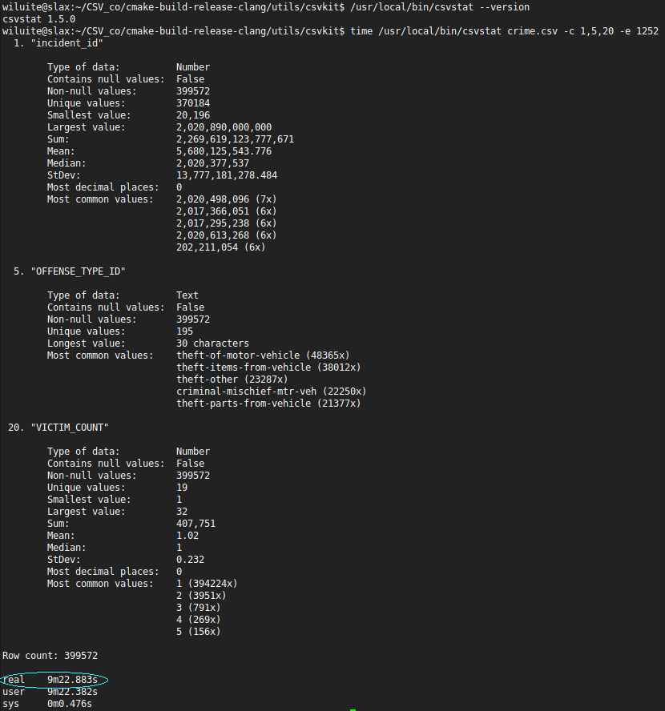
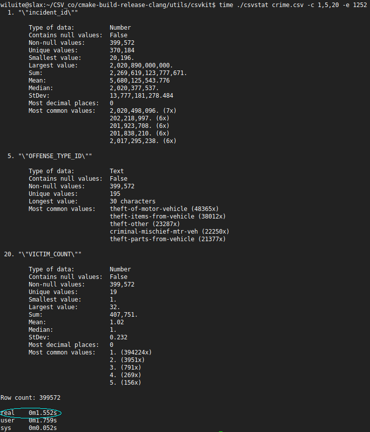

**Documentation is UNDER CONSTRUCTION NOW.**

# csvsuite
## The same as [csvkit](https://csvkit.readthedocs.io/en/latest/), but written in C++

*    [About](#about)
*    [Restrictions](#restrictions)
*    [Tutorial](#tutorial)
*    [Statistics performance](#statistics-performance)
*    [Sorting performance](#sorting-performance)
*    [SQL performance](#sql-performance)
*    [Build All](#build-all)
*    [Reference](#reference)

### About
_csvsuite_ is written to dramatically increase the speed of working with large amounts of data by taking advantage of
the high-performance compiled programming language C++.

It is written on top of the [csv_co](https://github.com/wiluite/CSV_co) CSV reader and, where needed, with the help of
the task-based parallelism library [transwarp](https://github.com/bloomen/transwarp) and the thread pool-based library
[poolSTL](https://github.com/alugowski/poolSTL).
It tries to reproduce the functionality of the [csvkit](https://csvkit.readthedocs.io/en/latest/) whenever possible.

The goals for the reproduction were: to find out the complexity and limitations of the applicability of the C++
ecosystem for broad universal tasks, where Python is good with its rich environment for data processing, text encoding,
localization, and so on. It was also interesting to see the performance benefits of C++ applications in non-traditional
areas. These utilities (from 14) seem to be almost fully operational at the moment:
1) csvClean (ala [csvclean](https://csvkit.readthedocs.io/en/latest/scripts/csvclean.html))
2) csvCut (ala [csvcut](https://csvkit.readthedocs.io/en/latest/scripts/csvcut.html))
3) csvGrep (ala [csvgrep](https://csvkit.readthedocs.io/en/latest/scripts/csvgrep.html))
4) csvJoin (ala [csvjoin](https://csvkit.readthedocs.io/en/latest/scripts/csvjoin.html))
5) csvJson (ala [csvjson](https://csvkit.readthedocs.io/en/latest/scripts/csvjson.html))
6) csvLook (ala [csvlook](https://csvkit.readthedocs.io/en/latest/scripts/csvlook.html))
7) csvSort (ala [csvsort](https://csvkit.readthedocs.io/en/latest/scripts/csvsort.html))
8) csvStack (ala [csvstack](https://csvkit.readthedocs.io/en/latest/scripts/csvstack.html))
9) csvStat (ala [csvstat](https://csvkit.readthedocs.io/en/latest/scripts/csvstat.html))
10) csvSql (ala [csvsql](https://csvkit.readthedocs.io/en/latest/scripts/csvsql.html))
11) Sql2csv (ala [sql2csv](https://csvkit.readthedocs.io/en/latest/scripts/sql2csv.html))
12) In2csv (ala [in2csv](https://csvkit.readthedocs.io/en/latest/scripts/in2csv.html))

<h4>Note: _csvsuite_ is in the active stage of development. But, as you will see, is already quite usable. Bug reports,
scenarios that failed and so on are welcome.</h4>

### Restrictions
1) Your CSV sources must be RFC-4180-compliant. Fortunately, the overwhelming percentage of documents in the world
adhere to this rule. If not, you can/should always resort to the csvClean (or even a more powerful one from the original
package: [csvclean](https://csvkit.readthedocs.io/en/latest/scripts/csvclean.html)), to fix your document. In any case,
this document just needs to be fixed.
2) The only 2 of utilities of the Python's original are not implemented for not being too actual:
[csvformat](https://csvkit.readthedocs.io/en/latest/scripts/csvformat.html),
[csvpy](https://csvkit.readthedocs.io/en/latest/scripts/csvpy.html).
3) Due to the fact the _csvsuite_ will work with RFC-4180-compliant only, the following utility arguments are missing:

	- **-d** DELIMITER, **--delimiter** DELIMITER
	- **-t**, --tabs
	- **-q** QUOTECHAR, **--quotechar** QUOTECHAR
	- **-u** {0,1,2,3}, **--quoting** {0,1,2,3}
	- **-b**, **--no-doublequote**
	- **-y** SNIFF_LIMIT, **--snifflimit** SNIFF_LIMIT

   The remaining arguments (or even newly introduced by the _csvsuite_) are present and almost certainly implemented.
When running, any utility tries to quickly check the strong tabular shape of your documents to match RFC-4180 and
whistles if this is not the case.
4) When handling date and datetime data types and their localization, the csvkit relies on the rich Python datetime
library. It also allows you to work with time representations such as 'yesterday', 'today', 'tomorrow', and so on.
The _csvsuite_, though, is tightly bound to the --date-format and --datetime-format arguments and works well only on
those platforms where this is supported by the environment/compiler/standard library. And the --date-lib-parser
argument engages the special [date](https://github.com/HowardHinnant/date) library to improve the situation and ensure
consistency everywhere (on most platforms). For more info see tests located in the
[csvsuite_core_test.cpp](https://github.com/wiluite/csvsuite/blob/main/suite/test/csvsuite_core_test.cpp) module.
5) Other possible restrictions are described below.

### Tutorial
### 1. Getting started
#### 1.1. About this tutorial
This tutorial should be almost exactly the same as the original tutorial.
#### 1.2. Installing csvsuite
The best way to install the tool is to simply download a required binary archive from the
[release](https://github.com/wiluite/csvsuite/releases) page and unpack it. Then add the path to the unpacked
subdirectory "suite" to the list of directories in which to search for commands, according to the rules for doing this
for this particular operating system.  
For an alternative software installation option, see the [Build All](#build-all) section.

#### 1.3. Remaining steps
Just repeat the lessons from the original training:
[1.3 - 1.8](https://csvkit.readthedocs.io/en/latest/tutorial/1_getting_started.html),
[2.1 - 2.4](https://csvkit.readthedocs.io/en/latest/tutorial/2_examining_the_data.html),
[3.1 - 3.4](https://csvkit.readthedocs.io/en/latest/tutorial/3_power_tools.html),
[4.1](https://csvkit.readthedocs.io/en/latest/tutorial/4_going_elsewhere.html), and make sure everything works,
but first pay attention to the following notes for changes for you to do.  

**_Note 1._** Parts of utility names that reflect their purpose are capitalized to avoid confusion between the
_csvsuite_ and the _csvkit_ on case-sensitive systems. Thus, you must type their names correctly. See their names in the
[About](#about) section.  

**_Note 2._** In paragraph 1.4, note that in the resulting data.csv document in the 10th column (ship_date), there is a
number, not a date. If this is too important for you right now, then to improve it, run the following command instead of
the one suggested:  
`In2csv ne_1033_data.xlsx --d-excel ship_date --is1904=0 > data.csv`  
The reason the _csvkit_ can detect the date automatically is because it relies on the heuristic capabilities of packages
like [xlrd](https://xlrd.readthedocs.io/en/latest/) and [openpyxl](https://openpyxl.readthedocs.io/en/stable/), which do
not guarantee that dates are correctly recognized, since Excel documents themselves do not have a date storage type. So
you are facing the necessity to always specify which numeric columns and using which era you want to convert to dates or
datetimes.  

**_Note 3._** In paragraphs where _csvLook_ is used, you will not see (by default) separators in the numbers displayed
on the screen, unlike _csvStat_, which displays number separator according to the current global locale. This is because
in the *csvkit* there is a difference between the locales according to which numbers are output in the two utilities.
To overcome this contradiction and still see separators in numbers, simply specify the locale in which you want to see
them. For example:  
`csvCut -c acquisition_cost data.csv | csvLook data.csv -G en_US`  
or  
`csvCut -c acquisition_cost data.csv | csvLook data.csv -G en_US.utf-8`  
where -G option is a "Superseded global locale".  

**_Note 4._**
In the _csvStat_ utility, "Most common values" with the same number of repetitions may not be the same as in the
original utility, due to different sorting algorithms. To display more data, use the --freq-count option.

**_Note 5._** In paragraph 3.3 you must use: `--db sqlite3://leso.db` instead of `--db sqlite:///leso.db`. For more
details, see the description of the --db option in the utilities [csvSql](#csvsql) and [Sql2csv](#sql2csv).


### Statistics performance
There were measured the performances of three tools: [csvkit(1.5.0)'s csvstat](https://pypi.org/project/csvkit/), 
[xsv(0.13.0)' stats](https://github.com/BurntSushi/xsv/releases/tag/0.13.0) and this one (csv_co's csvstat) at files: 
crime.csv, worldcitiespop.csv, flights.csv and question_tags.csv with (or with no) a limited number of columns
(so as not to break up screenshots). Here are the results (csvkit, xsv, and this tool screenshots):  

<h3>(crime.csv)(csvkit)</h3> 
 
 
-
<h3>(crime.csv)(xsv)</h3>  

 
-
<h3>(crime.csv)(this tool)</h3>
  
 

Here, xsv is the winner. It produces results in less than a second.  
The peculiarity of this file is that it is not utf8-encoded and that its fields are heavily quoted.  

<h3>(worldcitiespop.csv)(csvkit)</h3>


-
<h3>(worldcitiespop.csv)(xsv)</h3>


-
<h3>(worldcitiespop.csv)(this tool)</h3>


Here, this tool is even faster. 
Note: since xsv does not calculate 'most decimal places' in its statistics, unlike csvkit, we have disabled this time-consuming 
option at ours.

<h3>(flights.csv)(csvkit)</h3>


-
<h3>(flights.csv)(xsv)</h3>


-
<h3>(flights.csv)(this tool)</h3>


Here we again beat xsv by more than 2 times by doing statistics on the first 10 columns.
If we did full statistics on all columns, xsv would run out of memory on our current machine (now we had 12 GB RAM), 
as in the following test.

<h3>(question_tags.csv)(xsv)</h3>


-
<h3>(question_tags.csv)(this tool)</h3>


Our tool gives the result in about 42 seconds. Here we could not wait for the result from csvkit within a reasonable time. 
Thus, both csvkit and xsv are unable to produce their results where for csv_co' csvstat the reasons why this is not possible 
are not the case. This is a subject for further research.

### Sorting performance
If we talk about sorting by columns of string types, then the xsv is unrivaled, far ahead of other means in time, because
it obviously uses efficient algorithms for sorting strings, and without the use of parallelism. However, let's see how
effective it is to sort a group of columns where there is one numeric type (the -N option is required, otherwise the
results will be incorrect). We only need about 7 seconds versus 21 at the xsv. The csvkit is more than a minute behind us.


### SQL performance
C++ is said to outperform Python in general, non-specialized areas by about 3 times. In this case, it is so. And even
better. In light of the impossibility of parallelizing the filling of the database table using language tools.
Here it turned out 4 times faster, because the csvkit spends a significant part of the time determining column types,
unlike our tool.


### Build All

<h4>Note. For now, you need Python installed. This is to configure one of libraries used. Over time, this dependence will be removed.</h4>

_Conventional:_
```bash
mkdir build && cd build
cmake ..
make -j 4
```

_Better (if you have clang, libc++-dev, libc++abi-dev packages or their analogs installed):_
```bash
mkdir build && cd build
cmake -DCMAKE_CXX_COMPILER=clang++ -D_STDLIB_LIBCPP=ON ..
make -j 4
```

_Best (if you simply have got clang):_
```bash
mkdir build && cd build
cmake -DCMAKE_CXX_COMPILER=clang++ -D_STDLIB_LIBCPP=OFF ..
make -j 4
```

_Check for memory safety (if you have clang sanitizers packages installed):_
```bash
mkdir build && cd build
cmake -DCMAKE_CXX_COMPILER=clang++ -D_SANITY_CHECK=ON -DCMAKE_BUILD_TYPE=Debug ..
make -j 4
```

_MSVC (in x64 Native Tools Command Prompt):_  
```bash
mkdir build && cd build
cmake -G "Visual Studio 17 2022" -DCMAKE_BUILD_TYPE=Release ..
msbuild /property:Configuration=Release csv_co.sln
```
_Running tests in MSVC:_
```bash
cd build/test
```
_Then, run all tests:_
```bash
ctest.exe -j 1 
```
_Or run a particular test (still staying in the test directory):_
```bash
Release/test.exe
```
### Reference
*    [Input](#input)
*    [Processing](#processing)
*    [Output and Analysis](#output-and-analysis)


#### Input
* [In2csv](#in2csv)
* [Sql2csv](#sql2csv)
#### In2csv
##### Description
Converts various tabular data formats into CSV.

Converting fixed width requires that you provide a schema file with the “-s” option. The schema file should have the
following format:  

_column,start,length  
name,0,30  
birthday,30,10  
age,40,3_  

The header line is required though the columns may be in any order:

Usage: In2csv arg_0  [options...]  
arg_0 : The file of a specified format to operate on. If omitted, will accept input as piped data via STDIN. [default: ]

Options:  
-z,--maxfieldsize : Maximum length of a single field in the input CSV file. [default: 4294967295]  
-e,--encoding : Specify the encoding of the input CSV file. [default: UTF-8]  
-S,--skipinitialspace : Ignore whitespace immediately following the delimiter. [implicit: "true", default: false]  
-H,--no-header-row : Specify that the input CSV file has no header row. Will create default headers (a,b,c,...). [implicit: "true", default: false]  
-K,--skip-lines : Specify the number of initial lines to skip before the header row (e.g. comments, copyright notices, empty rows). [default: 0]  
-v,--verbose : A flag to toggle verbose. [implicit: "true", default: false]
-l,--linenumbers : Insert a column of line numbers at the front of the output. Useful when piping to grep or as a simple primary key. [implicit: "true", default: false]  
--zero : When interpreting or displaying column numbers, use zero-based numbering instead of the default 1-based numbering. [implicit: "true", default: false]  
-Q,--quick-check : Quickly check the CSV source for matrix shape [implicit: "true", default: true]  
-L,--locale : Specify the locale ("C") of any formatted numbers. [default: C]  
--blanks : Do not convert "", "na", "n/a", "none", "null", "." to NULL. [implicit: "true", default: false]  
--null-value : Convert this value to NULL. --null-value can be specified multiple times. [default: unknown]  
--date-format : Specify a strptime date format string like "%m/%d/%Y". [default: %m/%d/%Y]  
--datetime-format : Specify a strptime datetime format string like "%m/%d/%Y %I:%M %p". [default: %m/%d/%Y %I:%M %p]  
--no-leading-zeroes : Do not convert a numeric value with leading zeroes to a number. [implicit: "true", default: false]  
-f,--format : The format {csv,dbf,fixed,geojson,json,ndjson,xls,xlsx} of the input file. If not specified will be inferred from the file type. [default: ]  
-s,--schema : Specify a CSV-formatted schema file for converting fixed-width files. See In2csv_test as example. [default: ]  
-k,--key : Specify a top-level key to look within for a list of objects to be converted when processing JSON. [default: ]  
-n,--names : Display sheet names from the input Excel file. [implicit: "true", default: false]  
--sheet : The name of the Excel sheet to operate on. [default: ]  
--write-sheets : The names of the Excel sheets to write to files, or "-" to write all sheets. [default: ]  
--use-sheet-names : Use the sheet names as file names when --write-sheets is set. [implicit: "true", default: false]  
--encoding-xls : Specify the encoding of the input XLS file. [default: UTF-8]  
--d-excel : A comma-separated list of numeric columns of the input XLS/XLSX/CSV source, considered as dates, e.g. "1,id,3-5". [default: none]  
--dt-excel : A comma-separated list of numeric columns of the input XLS/XLSX/CSV source, considered as datetimes, e.g. "1,id,3-5". [default: none]  
--is1904 : Epoch based on the 1900/1904 datemode for input XLSX source, or for the input CSV source, converted from XLS/XLSX. [implicit: "true", default: true]  
-I,--no-inference : Disable type inference (and --locale, --date-format, --datetime-format, --no-leading-zeroes) when parsing the input. [implicit: "true", default: false]  
--date-lib-parser : Use date library as Dates and DateTimes parser backend instead compiler-supported [implicit: "true", default: true]  
--ASAP : Print result output stream as soon as possible. [implicit: "true", default: true]  
--help : print help [implicit: "true", default: false]  

#### Sql2csv


#### Processing
* [csvClean](#csvclean)
* [csvCut](#csvcut)
* [csvGrep](#csvgrep)
* [csvJoin](#csvjoin)
* [csvSort](#csvsort)
* [csvStack](#csvstack)

#### csvClean
#### csvCut
#### csvGrep
#### csvJoin
#### csvSort
#### csvStack


#### Output and Analysis
* [csvJson](#csvjson)
* [csvLook](#csvlook)
* [csvSql](#csvsql)
* [csvStat](#csvstat)

#### csvJson
#### csvLook
#### csvSql
#### csvStat
